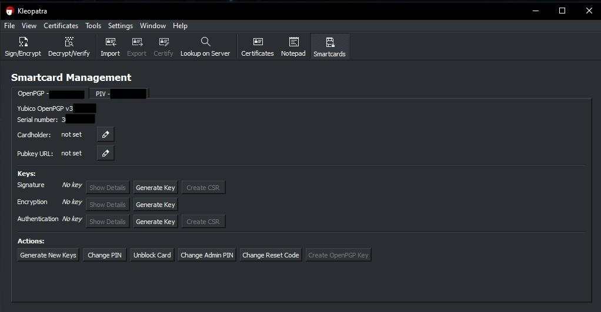
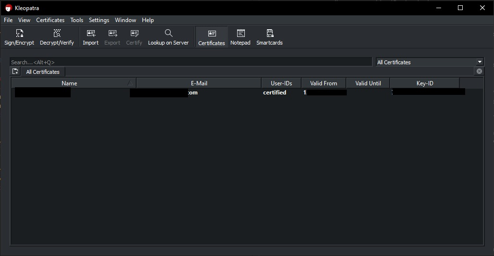

# Como criar chaves PGP ou GPG internas em dispositivos de segurança como as Yubikeys. - WIP ...

## Tabela de conteúdos


<br>

## Objetivo
- Este documento tem como finalidade compilar informação sobre como criar chaves PGP ou GPG internas num dispositivo de hardware de segurança. Neste exemplo, vamos usar uma Yubikey 5, num ambiente Windows em final de 2024. Grande parte das configurações também se aplica ao sistema operativo Linux.
- Para partilhar como orientação geral e disponibilizar o tema em língua Portuguesa. Não tem como objetivo ser um guia detalhado. No entanto, é um contributo ou mais uma gota de água para o oceano, para melhorar comunicações seguras.

<br>

## O que é o PGP ou GPG e para que serve?
  - [GnuPG ou GPG](https://gnupg.org/) é uma implementação livre do standard OpenPGP [RFC 4880](https://www.ietf.org/rfc/rfc4880.txt) que permite encriptação de dados e comuniçações bem como uma segura verificação dos interveninentes.  
  - Esta forma de encriptação e desincriptação permite a leitura ou partilha de textos, emails, ficheiros, directórios ou até de uma unidade de disco fisica ou virtual.
  - PGP, *Pretty Good Privacy*, é uma aplicação de encriptação e autenciação que nas suas versões mais recentes é compatível com o standard OpenPGP e GnuPG.
  - Entre Novembro de 2023 e Julho de 2024 uma nova atualização ao standard (RF4880) foi proposta pelos *developers* do GnuPG, a [RFC 9580](https://datatracker.ietf.org/doc/rfc9580/).
  -  As *security keys* ou chaves de segurança, aplicam estes standards e têm modelos que podem funcionar como uma *hardware wallet*. Ou seja, podem funcionar como uma carteira física de chaves PGP/GPG.
  - Com o PGP ou a variante GPG, por exemplo, podemos:
    - Encriptar informação.
    - Encriptar comunicações.
    - Verificar a autenticação.
    - Utilizar aplicações e serviços de forma segura.

<br>

## Chaves de segurança de hardware.
breves

## Resumo sobre o uso de chaves internas GPG e chaves externas GPG.

### Chaves externas GPG
- São chaves geradas, por norma, num computador das quais podemos ter um backup real da chave privada. As *subkeys* usadas para encriptação, assinatura e autenticação podem ser transferidas para a Yukibey.
- Este método garante que temos um método de recuperação através do backup no caso de perda da Yubikey. Deve ser feito de acordo com as boas práticas. Por exemplo num sistema *air-gapped*, sem acesso à internet ou outras redes, etc.
- Em relação à segurança, esta chave privada é gerada no computador, mas pode ser transferida como subkey para ser usada nas operações da Yubikey.
- O processo é, criar o par de chaves GPG no computador, fazer backup das chaves para um lugar externo (offline recomendado) e criar as respectivas subkeys na chave de segurança.

### Chaves internas GPG
- São chaves geradas directamente na Yubikey. A chave privada nunca é exportada e não tem um backup original.
- Este método nunca expõe a verdadeira chave privada fora da Yubikey, mas isto também significa que não é possivel copiar ou clonar a chave. Em caso de perda da chave de hardware de segurança, a chave privada GPG também é perdida e todas as operações dependentes da chave GPG ficam impossibilitadas. 
- Esta forma de segurança, é muito mais robusta.
- As chaves são criadas e armazenadas dentro da Yubikey.


### Breve resumo entre ambas
- As chaves GPG externas são mais flexíveis e recuperáveis, podem ser mais complexas de configurar.
- As chaves GPG internas são muito seguras, mas não temos possibilidade de fazer um backup.
- Dependendo dos cenários, ambas terão o seu uso. Se, por exemplo, temos que gerir múltiplos dispositivos e/ou múltiplos repositórios git, as chaves GPG externas são normalmente preferidas.
- Existem várias formas de uso como também a possiblidade de usar ambos os tipos de chaves. Por exemplo, chave GPG interna para autenticação e uso de chaves GPG externas para serviços, como tranferencia de ficheiros.
- O método recomendado pela yubikey é de criar chaves GPG externas. [link](https://support.yubico.com/hc/en-us/articles/360013790259-Using-Your-YubiKey-with-OpenPGP)
- Neste documento vamos abordar a criação de **chaves GPG internas**.

<br>

## Configurações iniciais

- Num sistema operativo Windows, é necessário ter instalado software compativel com OpenGPG pela linha de comandos e/ou uma ferramenta gráfica de gestão de criptografia.

- Numa janela do terminal ou powershell aberta com permissões de administrador:
  - Procuramos software relacionado com **gpg**, `winget search gpg`
  ```powershell
  winget search gpg


  Name                                                             Id                     Version Match        Source
  --------------------------------------------------------------------------------------------------------------------
  GPG ICT Summit                                                   9NBLGGH4XT16           Unknown              msstore
  GpgFrontend - OpenPGP/GnuPG crypto, sign and key management Tool 9NH716MQK2B5           Unknown              msstore
  GNU Privacy Guard                                                GnuPG.GnuPG            2.4.6   Command: gpg winget
  Gpg4win                                                          GnuPG.Gpg4win          4.3.1   Command: gpg winget
  Keybase                                                          Keybase.Keybase        6.2.4   Tag: gpg     winget
  GpgFrontend                                                      Saturneric.GpgFrontend 2.1.3   Tag: gpg     winget
  Gopass CLI                                                       gopass.gopass          1.15.13 Tag: gpg     winget
  Minisign                                                         jedisct1.minisign      0.11    Tag: gpg     winget
  ArrayFire                                                        ArrayFire.ArrayFire    3.9.0   Tag: gpgpu   winget
  ```
    - E dos vários vamo selecionar o **Gpg4win** para instalar.

- para instalar o **Gpg4win**:
  ```powershell
  winget install Gpg4win
  ```


## Mudar o PIN e Admin PIN para o serviço GPG na Yubikey.

- Uma das ferramentas que `Gpg4win` instala é o [**Kleopatra**](https://apps.kde.org/kleopatra/) que é uma ferramenta gráfica open-source que gere certificados e disponibiliza vários serviços de criptografia com foco no OpenGPG.

  - No nosso caso, a primeira coisa a fazer no menu *Smartcards* é mudar o **Admin PIN** e o **PIN**   
  
  - Estes *Pins*, são uma proteção de segurança em caso de perda ou roubo da Yubikey. Deste modo e com um número limitado de tentativas (3), se o utilizador não souber os *Pins* é quase impossível aceder a estas funções.
  
  - Por *default* o PIN vem com a pass 123456 e o Admin PIN 12345678.
  - Estes passos são essenciais se queremos usar a funcionalidade da GPG/PGP na Yubikey.


## Configurações.


- Para vermos a informação básica no cartão da yubikey:
  - antes de executar o comando, é recomendado fechar a aplicação *Yubikey Manager*.
  ```powershell
  gpg --card-status

  Reader ...........: Yubico YubiKey OTP FIDO CCID 0
  Application ID ...: D2760001240100000006244555330000
  Application type .: OpenPGP
  Version ..........: 3.4
  Manufacturer .....: Yubico
  Serial number ....: 24455533
  Name of cardholder: [não definido]
  Language prefs ...: [não definido]
  Salutation .......:
  URL of public key : [não definido]
  Login data .......: [não definido]
  Signature PIN ....: não forçado
  Key attributes ...: rsa2048 rsa2048 rsa2048
  Max. PIN lengths .: 127 127 127
  PIN retry counter : 3 0 3
  Signature counter : 0
  KDF setting ......: off
  UIF setting ......: Sign=off Decrypt=off Auth=off
  Signature key ....: [none]
  Encryption key....: [none]
  Authentication key: [none]
  General key info..: [none]
  ```

- Para começar a editar funcionalidades no cartão, entramos no modo edit:
  ```powershell
  gpg --card-edit

  Reader ...........: Yubico YubiKey OTP FIDO CCID 0
  Application ID ...: D2760001240100000006244555330000
  Application type .: OpenPGP
  Version ..........: 3.4
  Manufacturer .....: Yubico
  Serial number ....: 24455533
  Name of cardholder: [não definido]
  Language prefs ...: [não definido]
  Salutation .......:
  URL of public key : [não definido]
  Login data .......: [não definido]
  Signature PIN ....: não forçado
  Key attributes ...: rsa2048 rsa2048 rsa2048
  Max. PIN lengths .: 127 127 127
  PIN retry counter : 3 0 3
  Signature counter : 0
  KDF setting ......: off
  UIF setting ......: Sign=off Decrypt=off Auth=off
  Signature key ....: [none]
  Encryption key....: [none]
  Authentication key: [none]
  General key info..: [none]

  gpg/cartão>
  ```
- Nesta altura, "estamos dentro" do cartão. O comando `help`:.

  ```powershell
  gpg/cartão> help
  quit           sair deste menu
  admin          mostrar comandos de admin
  help           mostra esta ajuda
  list           listar todos os dados disponíveis
  fetch          buscar a chave especificada na URL do cartão
  passwd         menu para alterar ou desbloquear o PIN
  verify         verificar o PIN e listar todos os dados
  unblock        desbloquear o PIN usando um Código de Reset
  openpgp        mudar para a app OpenPGP
  ```

- Entrando no modo `admin`:
  ```powershell
  gpg/cartão> admin
  Comandos de Admin são permitidos
  ```

- Agora se voltarmos a executar o comando `help`, podemos ver todos os comandos disponíveis pois estamos em modo `admin`
  ```powershell
  gpg/cartão> admin
  Comandos de Admin são permitidos

  gpg/cartão> help
  quit           sair deste menu
  admin          mostrar comandos de admin
  help           mostra esta ajuda
  list           listar todos os dados disponíveis
  name           alterar o nome do titular do cartão
  url            alterar URL para buscar a chave
  fetch          buscar a chave especificada na URL do cartão
  login          alterar o nome de login
  lang           alterar as preferências de idioma
  salutation     alterar a saudação do titular do cartão
  cafpr          alterar uma impressão digital da CA
  forcesig       alternar a flag de PIN forçado de assinatura
  generate       gerar novas chaves
  passwd         menu para alterar ou desbloquear o PIN
  verify         verificar o PIN e listar todos os dados
  unblock        desbloquear o PIN usando um Código de Reset
  factory-reset  destruir todas as chaves e dados
  kdf-setup      configurar o KDF para autenticação por PIN (on/single/off)
  key-attr       alterar o atributo da chave
  uif            alterar a Flag User Interaction
  openpgp        mudar para a app OpenPGP
  ```


- o comando `list`:
  ```powershell
  Reader ...........: Yubico YubiKey OTP FIDO CCID 0
  Application ID ...: D2760001240100000006244555330000
  Application type .: OpenPGP
  Version ..........: 3.4
  Manufacturer .....: Yubico
  Serial number ....: 24455533
  Name of cardholder: [não definido]
  Language prefs ...: [não definido]
  Salutation .......:
  URL of public key : [não definido]
  Login data .......: [não definido]
  Signature PIN ....: não forçado
  Key attributes ...: rsa2048 rsa2048 rsa2048
  Max. PIN lengths .: 127 127 127
  PIN retry counter : 3 0 3
  Signature counter : 0
  KDF setting ......: off
  UIF setting ......: Sign=off Decrypt=off Auth=off
  Signature key ....: [none]
  Encryption key....: [none]
  Authentication key: [none]
  General key info..: [none]
  ```
  - Podemos ver que de fábrica, o `Key attributes` é rsa2048. É melhor usar rsa4096,ou melhor ainda, Criptografia de Curva Elíptica (ECC).

- Para mudar isso, usamos o comando `key-attr`, (estando em modo admin):
    ```powershell
    gpg/cartão> key-attr
    Alterando o atributo de chave do cartão para: Chave de assinatura
    Selecione o tipo de chave desejado:
      (1) RSA
      (2) ECC
    Sua opção? 2
    Selecione qual a curva elíptica que você deseja:
      (1) Curve 25519 *pré-definição*
      (4) NIST P-384
      (6) Brainpool P-256
    Sua opção? 1
    O cartão agora será reconfigurado para gerar uma chave do tipo: ed25519
    Nota: Não há garantia de que o cartão suporte o tipo ou tamanho de
          chave pedida. Se a geração de chaves não for bem-sucedida,
          verifique a documentação do seu cartão para ver quais são os
          tipos e tamanhos de chaves suportados.
    Alterando o atributo de chave do cartão para: Chave de cifração
    Selecione o tipo de chave desejado:
      (1) RSA
      (2) ECC
    Sua opção? 2
    Selecione qual a curva elíptica que você deseja:
      (1) Curve 25519 *pré-definição*
      (4) NIST P-384
      (6) Brainpool P-256
    Sua opção? 1
    O cartão agora será reconfigurado para gerar uma chave do tipo: cv25519
    Alterando o atributo de chave do cartão para: Chave de autenticação
    Selecione o tipo de chave desejado:
      (1) RSA
      (2) ECC
    Sua opção? 2
    Selecione qual a curva elíptica que você deseja:
      (1) Curve 25519 *pré-definição*
      (4) NIST P-384
      (6) Brainpool P-256
    Sua opção? 1
    O cartão agora será reconfigurado para gerar uma chave do tipo: ed25519
    ```
    -  vai ser perguntado 3 vezes e para cada é necessário introduzirmos o nosso **Admin Pin**

- agora executando o comando `list` outra vez , podemos verificar que usamos ed25519 cv25519 ed25519:
  ```powershell
  gpg/cartão> list

  Reader ...........: Yubico YubiKey OTP FIDO CCID 0
  Application ID ...: D2760001240100000006244555330000
  Application type .: OpenPGP
  Version ..........: 3.4
  Manufacturer .....: Yubico
  Serial number ....: 24455533
  Name of cardholder: [não definido]
  Language prefs ...: [não definido]
  Salutation .......:
  URL of public key : [não definido]
  Login data .......: [não definido]
  Signature PIN ....: não forçado
  Key attributes ...: ed25519 cv25519 ed25519
  Max. PIN lengths .: 127 127 127
  PIN retry counter : 3 0 3
  Signature counter : 0
  KDF setting ......: off
  UIF setting ......: Sign=off Decrypt=off Auth=off
  Signature key ....: [none]
  Encryption key....: [none]
  Authentication key: [none]
  General key info..: [none]
  ```


## Criar chave GPG na Yubikey.

- O comando `generate` vai criar a chave dentro da Yubikey.

- Quando nos é perguntado se queremos guardar um backup, ter em conta que:
  - esse backup, é apenas uma "referência" à chave original que apenas reside na Yubikey.
  - Não é possível copiar esse backup para outra Yubikey.
  - É aconsehável guardar esse backup, mas lembrar que apenas o podemos usar se tivermos a chave física Yubikey.

- Ecrevemos `s` para iniciar o processo e devemos introduzir o nosso GPG PIN previamente definido.

  ```powershell
  gpg/cartão> generate
  Fazer backup fora-do-cartão da chave de cifração? (S/n) S

  Observe que as configurações de fábrica dos PINs são
    PIN = '123456'  PIN do Admin = '12345678'
  Você deve alterá-los usando o comando --change-pin

  Especifique quando a chave expira.
          0 = chave não expira
        <n>  = chave expira em n dias
        <n>w = chave expira em n semanas
        <n>m = chave expira em n meses
        <n>y = chave expira em n anos
  Quando a chave expira? (0) 0
  A chave não expira de forma alguma
  Isto está correto? (s/N) s

  O GnuPG precisa construir uma ID de utilizador para identificar sua chave.

  Nome verdadeiro: Meu Nome
  Endereço de email: meuemail@email.com
  Comentário:
  Você selecionou este USER-ID:
      "Meu Nome <meuemail@email.com>"

  Alterar (N)ome, (C)omentário, (E)ndereço, ou (O)k/(S)air? o

  Precisamos gerar muitos bytes aleatórios. É uma boa ideia realizar outra
  atividade (escrever no teclado, mover o rato, usar os discos) durante a
  geração dos números primos; isto dá ao gerador de números aleatórios
  uma hipótese maior de ganhar entropia suficiente.
  gpg: Nota: backup da chave do cartão guardada em 'C:\\Users\\User\\AppData\\Roaming\\gnupg\\sk_FA11HHD424kVF4D.gpg'
  gpg: pasta 'C:\\Users\\User\\AppData\\Roaming\\gnupg\\openpgp-revocs.d' criada
  gpg: certificado de revogação armazenado como 'C:\\Users\\User\\AppData\\Roaming\\gnupg\\openpgp-revocs.d\\45GGAS880SFG9CVB9DDA594ADF.rev'
  chaves pública e privada criadas e assinadas.
  ```


- O tempo de validade para a chave estar válida, vamos escolher não expirar (0) neste caso. Pode ser modificada mais tarde.

- Quando nos pede o nome e sobrenome, devemos considerar o propósito da chave de segurança que estamos a criar, para fins pessoais colocar o nome verdadeiro assim como o nosso email principal. Mais sobre este campo masi abaixo, mas referir que o email serve como identificador da chave.

- O comentário é opcional.

- Quando nos apresenta o resumo devemos verificar a info e prosseguir com as opções. Escolhemos `o` para dar o Ok.

-  Nesta fase vai-nos ser pedido o Admin PIN.

- Vai ser também pedido para proteger a chave com uma *Passphrase*. É obrigatório
  - Esta *Passphrase*, neste caso, tem mais o sentido de proteger a chave para exportação, ou seja usar fora da Yubikey. Contudo, relembrar que a chave que é exportada não é a chave privada original, é uma referência à mesma contém parte da chave privada. Se perdermos a Yubikey, não é mais possivel usar estas chaves exportadas.


- No final, podemos verificar a chave de referência/backup ficam na localização `C:\Users\User\AppData\Roaming\gnupg`.

- No programa *Kleopatra* podemos verificar no menu dos certificados que temos presente neste computador a chave. Esta, é a referência, o backup que aceitámos quando criamos a chave na Yubikey. Ou seja está presente mas necessita da Yubikey física para ser usado.

  


- Voilà, já temos uma chave GPG interna na Yubikey e reconhecida no nosso sistema. É importante lembrar que este método pode não ser adequado para uso ao longo de vários anos. Apesar de ser o mais seguro, uma vez a Yukibey, danificada, perdida ou bloqueada, esta chave fica inutilizada.

- Cenários de perda da chave Yubikey:
  - no caso de usar a GPG para desencriptar comuniçações como informação enviada como segredo, o que não foi desencriptado antes e guardado fica encriptado. Uma nova chave PGP pode ser criada para continuar a ter as comunicações encriptadas.

  - no caso de usarmos as chaves GPG/PGP para arquivar segredos ou passwords nalgum dispositivo. É algo indesejável, pois esses segredos ou passwords, não podem ser mais desencriptados. Para este cenário é possível considerar a criação de chaves GPG/PGP externas de acordo com as melhores práticas. 


- Devemos **exportar** a nossa chave pública e fazer **backup** da mesma. Para utilizar como importação noutro sistema ou para partihar para que outros possam encriptar utilizando essa chave pública. Ainda usando a imagem anterior, no mesmo certificado, clicamos com o lado direito do rato e escolhemos a opção `Exportar...`. Uma janela com a localização para guardar e o nome a atribuir ao ficheiro deve ser preenchida. O conteúdo do ficheiro, por norma em formato `.asc` mas pode ser outro, pode ser visto num bloco de notas e esta é a nossa chave pública que de ser algo como, exemplo:
 
    ```powershell
    -----BEGIN PGP PUBLIC KEY BLOCK-----

    sdsdfsd43543543dgd/DSSSDASDAS23222fgdklççfdssdf
    WoR4r343543634gdf76868jghhge34dsadsaasdasgs55gg
    1pRyqBQJnNMWQAhsgA2321hhaaFFAssd3+sdsdfsdfsa224
    NMWQAhsgAAoJEHKVasddAAAAASdsfsd23234237dfds/asa
    ...
    ...
    ...
    -----END PGP PUBLIC KEY BLOCK-----
    ```

<br>

## Ativar o *touch*, toque na Yubikey para operações PGP/GPG.

- De fábrica, o OpenGPG na Yubikey não tem a função de "tocar necessário" ativada. Vamos ativar essa função para quando vamos assinar algo. Para isso, devemos estar numa janela de terminal do windows em modo *admin* e na pasta da instalação do Yubikey Manager. Isto porque o programa que vamos usar `ykman` pode não estar disponível globalmente no sistema.

- Verificar que estamos na pasta correta, depois de abrir o terminal em modo admin:

  ```powershell
  # em powershell, deve ser a localização:
  cd "C:\Program Files\Yubico\YubiKey Manager\"

  # em janela de terminal windows:
  cd \ && cd .\Program Files\Yubico\YubiKey Manager\
  ```


- Uma vez dentro da pasta anterior, o comando `ykman` deve ser executado correctamente. Vamos verificar as políticas de tocar requerido para PGP:
  ```powershell
  .\ykman openpgp info
  
  OpenPGP version:            3.4
  Application version:        5.7.1
  PIN tries remaining:        3
  Reset code tries remaining: 0
  Admin PIN tries remaining:  3
  Require PIN for signature:  Once
  KDF enabled:                False
  Touch policies:            
    Signature key:      Off
    Encryption key:     Off
    Authentication key: Off
    Attestation key:    Off

  ```
   - Como podemos ver que estão a Off, vêm configuradas assim de fábrica.
   - Pela informação recolhida, devemos ativar o touch. Neste caso vamos ativar para assinatura, encriptação e autenticação.


- Podemos ver as opções do comando que vamos executar a seguir com a opção `-h`.
  ```powershell
  .\ykman openpgp keys set-touch -h
  ```

- Para ativarmos o toque das funções PGP, executamos um comando de cada vez para **aut**, **sig** e **enc** . Vai-nos ser pedido o Admin Pin para cada. Não devemos ter outra applicação aberta como Kleopatra ou o Yubikey Manager.
  ```powershell
  .\ykman openpgp keys set-touch aut on

  .\ykman openpgp keys set-touch enc on
  ```

- Para o caso de operações com `git` onde é muito frequente a verificação PGP, a opção `cached` evita estarmos sempre a tocar na chave.
  ```powershell
  .\ykman openpgp keys set-touch sig cached
  Enter Admin PIN: 
  Set touch policy of SIG key to cached? [y/N]: y
  Touch policy for slot SIG set.
  ```
- Verificar as alterações:

  ```powershell
  .\ykman openpgp info
  OpenPGP version:            3.4
  Application version:        5.7.1
  PIN tries remaining:        3
  Reset code tries remaining: 0
  Admin PIN tries remaining:  3
  Require PIN for signature:  Once
  KDF enabled:                False
  Touch policies:            
    Signature key:      Cached
    Encryption key:     On
    Authentication key: On
    Attestation key:    Off

  ``` 

Fim.

<br>

## Outros

1 - Comandos úteis

- ykman help
  ```powershell
  ykman -h

  ```

- ykman list
  ```powershell
  ykman list
  ```

- ykman information
  ```powershell
  ykman info
  ```

- ykman configuration. Ativar ou desativar applicações
  ```powershell
  ykman config -h
  ```

- ykman openpgp
  ```powershell
  ykman openpgp
  ```

<br>

2 - Configurar o git em Linux para assinar os commits com PGP/GPG

- Um *signed commit* garante que o *commit* não foi forjado por outra pessoa. Como o commit tem uma assinatura, esta garante que apenas a pessoa com a chave para tal é a única possível.


Em Linux:


- Qual o caminho para o gpg default?
```sh
which gpg

#deve retornar o caminho do gpg, algo como
/usr/bin/gpg
```


- Configurar git para usar o gpg.
```sh
git config --global gpg.program /usr/bin/gpg
``` 

- Verificar.
```sh
git config --global --get gpg.program
``` 

- Obter o ID da chave.
```sh
gpg2 --list-secret-keys --keyid-format LONG
``` 

- Será a parte *`ABCD1234EF567890` após o /
```sh
  /home/user/.gnupg/chave.gpg
  ------------------------------
  sec   rsa4096/ABCD1234EF567890 2019-01-01 [SC] [expires: 2024-01-01]
  uid           [ unknown] Nome do User <email@example.com>
  ssb   rsa4096/1234ABCD5678EF90 2019-01-01 [E] [expires: 2024-01-01]
``` 

- Configuar o git para usar o ID da chave PGP/GPG.
```sh
git config --global user.signingkey ABCD1234EF567890
``` 

- Podemos verificar se está correto?
```sh
git config --global --get user.signingkey
``` 

- Para que todos os commits sejam assinados automaticamente, ou seja, rejeita-os caso as credenciais PGP não devidamente configuradas para o commit automático com assinatura.
```sh
git config --global commit.gpgSign true
``` 

- É necessário copiar a chave pública para a secção das GPG Keys no github.

- Testar, num repo de teste fazer uma alteração.
```sh
git commit -am "Teste de commit assinado"
``` 

- Verificar se o commit foi devidamente assinado.
```sh
git log --show-signature
``` 

- E podemos fazer um *push* simples.
```sh
git push origin main
``` 


- Caso o repositório de teste tenha sido clonado via https, podemos alterar a url remota para usar ssh para publicar/transmitir a informação
```powershell
git remote set-url origin git@github.com:utilizador/repositorio.git
``` 
<br>

3- Configurar o Git em Windows para usar PGP/GPG

1.  Num sistema windows devidamente configurando com as ferramenats necessárias descritas no documento, (git, e as ferramentas PGP)

- Numa pasta local, clonamos ou iniciamos um repositório teste. Vamos configurar globalmente o git para usar o nosso programa GPG. A localização da pasta pode variar.

```powesehll
git config --global gpg.program "C:\Program Files (x86)\GnuPG\bin\gpg.exe" 
```

2. Mostar as chaves para identificar o nosso ID

```powershell
gpg --list-secret-keys --keyid-format=long
```

O ouput será algo como:
```powersehll
  sec   ed25519/ABCD1234EF567890 2019-01-01 [SC] [expires: 2024-01-01]
  uid           [ unknown] Nome do User <email@example.com>
  ssb   ed25519/1234ABCD5678EF90 2019-01-01 [E] [expires: 2024-01-01]
``` 
  - O ID da nossa chave é neste caso ABCD1234EF567890.

3. Configure the sign key globally (or locally to the repo): git config --global user.signingkey 
key-id-from-previous-command
```powershell
git config --global user.signingkey ID_DA_CHAVE_ANTERIOR
```
4. Configurar o git para assinar todos os commits. Evita uso `-S` em todos os commits.
```powershell
git config --global commit.gpgsign true
```
5. No serviço git a usar, por exemplo, no Github, temos que adicionar a nossa chave pública PGP/GPG para que este seriço possa verificar a nossa chave PGP/GPG.

<br>

BIB

## vids
  - [CodeWrecks - I bought a Yubikey now What - GPG on Yubikey](https://www.youtube.com/watch?v=PWHM5etA6F4)
  - [CodeWrecks - I bought a Yubikey now what: More about GPG/PGP](https://www.youtube.com/watch?v=TYT8dpTUkN0)
  - [CodeWrecks - I bought a Yubikey now what - Sign Git Commits with GPG](https://www.youtube.com/watch?v=6ftI9WvYRjA)
  - [Yubico - Configuring YubiKey 5 for SSH/GPG access to GitHub](https://www.youtube.com/watch?v=fEftwheNMm8)


## Docs
  - https://gnupg.org/
  - https://en.wikipedia.org/wiki/GNU_Privacy_Guard
  - https://en.wikipedia.org/wiki/Pretty_Good_Privacy
  - https://support.yubico.com/hc/en-us/articles/360013790259-Using-Your-YubiKey-with-OpenPGP

  - https://github.com/drduh/YubiKey-Guide
